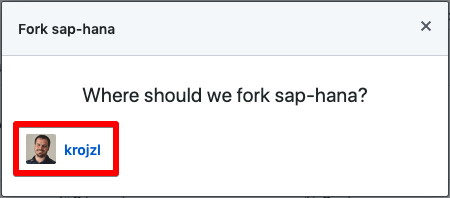
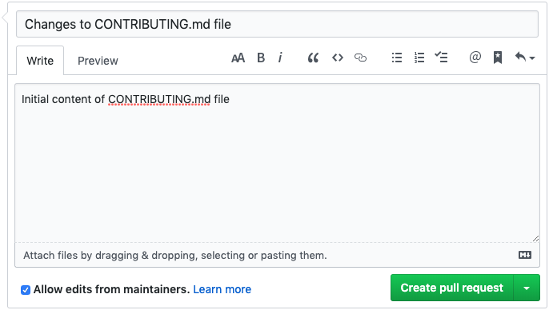

# How to Contribute

If you want to contribute to a project and make it better, your help is very welcome. Please see below instructions how to contribute.

## Table of Content

* [1. Initial Setup](#1-initial-setup)
* [2. Recurrent synchronization](#2-recurrent-synchronization)
* [3. Add new Content and Commit](#3-add-new-content-and-commit)
* [4. Upload to main project repository](#4-upload-to-main-project-repository)

## 1. Initial Setup

Perform following section only once at the beginning of your contribution.

### 1.1. Create GitHub user

Detailed instructions are here: <https://help.github.com/en/articles/signing-up-for-a-new-github-account>

### 1.2. Add SSH key

Adding SSH key will enable password-less connectivity to GitHub.

Detailed instructions are here: <https://help.github.com/en/articles/adding-a-new-ssh-key-to-your-github-account>

### 1.3. Fork the repository

Forking the repository will create your own personal copy of the repository.

1. Navigate to the project repository: <https://github.com/sap-architecture/sap-hana>

2. Click on `Fork` button in upper-right corner of the page

    

3. Select your user to create copy in your private space

    

4. As result you should see that repository was forked to your personal space:

    

Detailed instructions are here: <https://help.github.com/en/articles/fork-a-repo>

### 1.4. Clone the forked repository

Clone your personal copy of the repository to your workstation.

1. Navigate to the forked repository: `https://github.com/<YOUR-USER>/sap-hana`

2. Click `Clone or download` button in upper-right corner of the page

    

    Note: In order to use SSH to connect to GitHub you need to click on `Use SSH` in upper-right corner of the panel

3. Copy the URL from the panel: `git@github.com:<YOUR-USER>/sap-hana.git`

4. Open Terminal and change directory to desired location

5. Run `git` command to clone the repository

    ```bash
    # git clone git@github.com:<YOUR-USER>/sap-hana.git
    Cloning into 'sap-hana'...
    remote: Enumerating objects: 7, done.
    remote: Counting objects: 100% (7/7), done.
    remote: Compressing objects: 100% (6/6), done.
    remote: Total 7 (delta 0), reused 3 (delta 0), pack-reused 0
    Receiving objects: 100% (7/7), done.
    ```

Detailed instructions are here: <https://help.github.com/en/articles/fork-a-repo>

### 1.5. Configure synchronization

Configure forked repository synchronization with main project repository.

1. Open Terminal and change directory to location of your local copy of the repository: `cd /path-to-your-repository/sap-hana`

2. List currently defined remote repositories:

    ```bash
    # git remote -v
    origin    git@github.com:<YOUR-USER>/sap-hana.git (fetch)
    origin    git@github.com:<YOUR-USER>/sap-hana.git (push)
    ```

3. Add link to main project repository: `git remote add upstream git@github.com:sap-architecture/sap-hana.git`

4. List again defined remote repositories:

    ```bash
    # git remote -v
    origin    git@github.com:<YOUR-USER>/sap-hana.git (fetch)
    origin    git@github.com:<YOUR-USER>/sap-hana.git (push)
    upstream  git@github.com:sap-architecture/sap-hana.git (fetch)
    upstream  git@github.com:sap-architecture/sap-hana.git (push)
    ```

Detailed instructions are here: <https://help.github.com/en/articles/fork-a-repo>

## 2. Recurrent synchronization

Perform following section on regular basis and always before you create Pull Request to main project.

### 2.1. Download new content from main project repository

Download and merge new updates from main project repository into your local repository on your workstation.

1. Open Terminal and change directory to location of your local copy of the repository: `cd /path-to-your-repository/sap-hana`

2. Fetch the branchges and their content from the main project repository:

    ```bash
    # git fetch upstream
    remote: Enumerating objects: 13, done.
    remote: Counting objects: 100% (13/13), done.
    remote: Compressing objects: 100% (10/10), done.
    remote: Total 11 (delta 0), reused 10 (delta 0), pack-reused 0
    Unpacking objects: 100% (11/11), done.
    From github.com:sap-architecture/sap-hana
    * [new branch]      master     -> upstream/master
    ```

3. Change local repository branch to `master`

    ```bash
    # git checkout master
    Already on 'master'
    Your branch is up to date with 'origin/master'.
    ```

4. Merge changes from `upstream/master` into your local `master` branch

    ```bash
    # git merge upstream/master
    Updating 11569ab..469f8ab
    Fast-forward
    CHANGELOG.md                    |   5 +++++
    CONTRIBUTING.md                 |  46 ++++++++++++++++++++++++++++++++++++++++++++++
    README.md                       |   3 ++-
    images/contributing-clone-1.png | Bin 0 -> 18798 bytes
    images/contributing-fork-1.png  | Bin 0 -> 6350 bytes
    images/contributing-fork-2.png  | Bin 0 -> 15140 bytes
    images/contributing-fork-3.png  | Bin 0 -> 12140 bytes
    7 files changed, 53 insertions(+), 1 deletion(-)
    create mode 100644 CHANGELOG.md
    create mode 100644 CONTRIBUTING.md
    create mode 100644 images/contributing-clone-1.png
    create mode 100644 images/contributing-fork-1.png
    create mode 100644 images/contributing-fork-2.png
    create mode 100644 images/contributing-fork-3.png
    ```

5. In case there were merge conflicts you need to resolve them as described in <https://help.github.com/en/articles/resolving-a-merge-conflict-using-the-command-line>

Detailed instructions are here: <https://help.github.com/en/articles/syncing-a-fork>

### 2.2. Upload merged content to your GitHub repository

Upload merged content from your local repository on your workstation to your GitHub repository.

1. Open Terminal and change directory to location of your local copy of the repository: `cd /path-to-your-repository/sap-hana`

2. Upload the merged content in active branch to your GitHub repository

    ```bash
    # git push
    Total 0 (delta 0), reused 0 (delta 0)
    To github.com:<YOUR-USER>/sap-hana.git
      11569ab..469f8ab  master -> master
    ```

3. Now you can see the content online in your own personal copy of the repository in GitHub: `https://github.com/<YOUR-USER>/sap-hana`

Detailed instructions are here: <https://help.github.com/en/articles/pushing-commits-to-a-remote-repository>

## 3. Add new Content and Commit

Deliver new content by editing files on your local workstation, push to online GitHub and review.

### 3.1. Add or edit the documentation

The documentation is written in Markdown language.

Additional information about Markdown:

* [Basic writing and formatting syntax](https://help.github.com/en/articles/basic-writing-and-formatting-syntax)
* [Working with advanced formatting](https://help.github.com/en/articles/working-with-advanced-formatting)
* [Mastering Markdown](https://guides.github.com/features/mastering-markdown)
* [GitHub Flavored Markdown Spec](https://github.github.com/gfm)

Images should be uploaded into subdirectory `images` below directory where the page referencing the image is located.

Files should be uploaded into subdirectory `files` below directory where the page referencing the image is located.

Make sure you name all images and files in clear way.

All links to pages, images or files located in this repository should be based on relative paths - avoid using absolute paths as this will break the link functionality in forked repositories.

Use your favorite editor to add new content. Use Linting function to deliver clean and well structured documentation.

Recommended editors:

* [Visual Studio Code](https://code.visualstudio.com)
  * plugin [Markdown All in One](https://github.com/yzhang-gh/vscode-markdown)
  * plugin [Markdown Lint](https://github.com/DavidAnson/vscode-markdownlint)
* [Atom Editor](https://atom.io)

### 3.2. Commit the content to your local repository

When unit of work is completed commit the changes to your local repository on your local workstation.

Use either your editor to commit the changes (recommended) or perform following commands:

1. Open Terminal and change directory to location of your local copy of the repository: `cd /path-to-your-repository/sap-hana`

2. Check the status

    ```bash
    # git status
    On branch master
    Your branch is up to date with 'origin/master'.

    Changes not staged for commit:
      (use "git add <file>..." to update what will be committed)
      (use "git checkout -- <file>..." to discard changes in working directory)

          modified:   CONTRIBUTING.md

    no changes added to commit (use "git add" and/or "git commit -a")
    ```

    Note: In example above we can see file `CONTRIBUTING.md` is NOT part of commit.

3. Add files that should be included in commit

    * Add individual files: `git add <file_name>`
    * Add directory: `git add <directory_name>`

    In ordee to add all files perform `git add .`

4. Check the status again

    ```bash
    # git status
    On branch master
    Your branch is up to date with 'origin/master'.

    Changes to be committed:
      (use "git reset HEAD <file>..." to unstage)

           modified:   CONTRIBUTING.md
    ```

5. Commit changes to active branch

    ```bash
    # git commit -m "Update to CONTRIBUTING.md"
    [master d6a2568] Update to CONTRIBUTING.md
     1 file changed, 1 insertion(+), 1 deletion(-)
    ```

Detailed instructions are here: <https://help.github.com/en/articles/adding-a-file-to-a-repository-using-the-command-line>

### 3.3. Push changes to GitHub

Push your local changes from your local repository on your workstation to your GitHub repository.

1. Open Terminal and change directory to location of your local copy of the repository: `cd /path-to-your-repository/sap-hana`

2. Push changes from active branch to your GitHub repository

    ```bash
    # git push
    Enumerating objects: 8, done.
    Counting objects: 100% (8/8), done.
    Delta compression using up to 12 threads
    Compressing objects: 100% (6/6), done.
    Writing objects: 100% (6/6), 3.23 KiB | 3.23 MiB/s, done.
    Total 6 (delta 3), reused 0 (delta 0)
    remote: Resolving deltas: 100% (3/3), completed with 1 local object.
    To github.com:<YOUR-USER>/sap-hana.git
       469f8ab..d6a2568  master -> master
    ```

3. Review your changes online in your own personal copy of the repository in GitHub: `https://github.com/<YOUR-USER>/sap-hana`

Detailed instructions are here: <https://help.github.com/en/articles/adding-a-file-to-a-repository-using-the-command-line>

## 4. Upload to main project repository

Create Pull Request (PR) from your own GitHub repository against main project repository.

### 4.1. Synchronize your content with main project

Very likely your updates took some time. Meanwhile the content in main project repository changed and might be out of sync with your own repository.

Follow procedure described in section [2. Recurrent synchronization](#2-recurrent-synchronization).

### 4.2. Update `CHANGELOG.md` file

Make sure you document what was changed in `CHANGELOG.md` file. Make sure this very last change to avoid merge conflicts.

Follow procedure described in section [3. Add new Content and Commit](#3-add-new-content-and-commit) to adjust the file.

### 4.3. Create Pull Request

Before you create Pull Request (PR) make sure that:

* you downloaded and merged latest content from main project repository
* you resolved all merge conflicts
* you pushed all changes from your local repository on your workstation to online GitHub repository
* you reviewed your content online in GitHub `https://github.com/<YOUR-USER>/sap-hana` and confirmed the content is rendering correctly - that includes:
  * all images are properly displayed (and are relative)
  * all links are working properly (and are relative is pointing to page in same repository)

1. Navigate to the forked repository: `https://github.com/<YOUR-USER>/sap-hana`

2. Click `New pull request` button in upper-left part of the page

    

3. Review the Pull Request (PR) details

    

    Note: On left side you see destination (main project repository) and on left side you see source (your own forked repository).

4. In case all visualized changes are ok press `Create pull request` button

    

5. Add title and meaningful description and click `Create pull request` button

    

6. Wait for your Pull Request to be reviewed and respond to any request for changes

    Note: Until your Pull Request is accepted all your commits that are pushed to your forked repository in GitHub will be automatically included in given Pull Request.

    If you want to make commits that are not included in Pull Request consider using separate branch for your updates.

Detailed instructions are here: <https://help.github.com/en/articles/creating-a-pull-request-from-a-fork>
